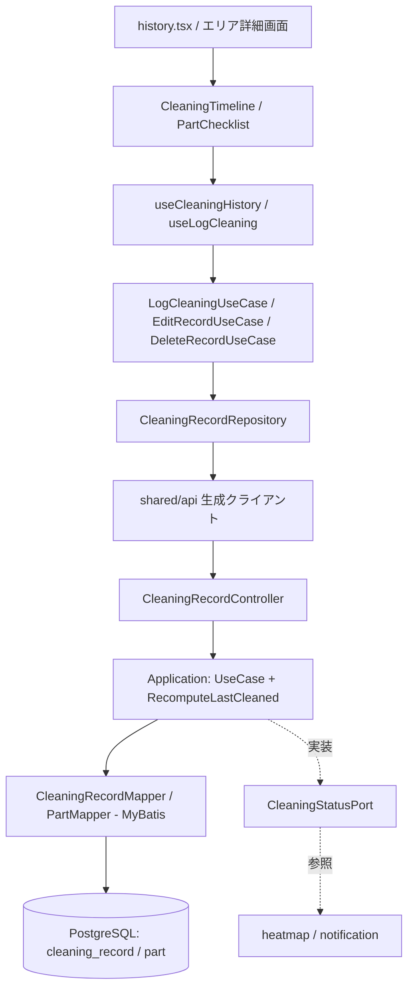

# Design Document — 掃除記録（cleaning-record）

## Overview

掃除記録機能は、パーツ単位の掃除イベント（CleaningRecord）を記録・閲覧・修正し、パーツの最終掃除日時（lastCleanedAt）を最新に保つ。lastCleanedAt は CleaningRecord から導出されるキャッシュであり、記録の追加・修正・削除のたびに対象パーツ分を再計算する。

この最終掃除日時と推奨周期は、`CleaningStatusCapability`（モバイル）/ `CleaningStatusPort`（バックエンド）を通じて heatmap・notification に公開する。Part エンティティは layout-editor と共有し、掃除記録（CleaningRecord）は本featureが所有する。

## Steering Document Alignment

### Technical Standards (tech.md)

- **サーバーファースト**: 掃除記録はサーバー（PostgreSQL）に保存。モバイルは TanStack Query でフェッチ・楽観的更新を行う
- **MyBatis**: CleaningRecordMapper でSQLを明示記述。最終掃除日時の再計算は `SELECT MAX(cleaned_at)` で行う
- **UUID主キー**: CleaningRecord も UUID v4 を主キーに持つ
- **OpenAPI契約ファースト**: エンドポイント・スキーマを `api/openapi.yaml` に定義して生成する

### Project Structure (structure.md)

- `features/cleaning-record/` に components / hooks / usecases / repositories / types.ts を配置
- `CleaningStatusCapability`（モバイル）の実装 `CleaningStatusCapabilityImpl` を repositories/ に置き、di.ts で配線
- バックエンドは `cleaningrecord/` に presentation / application / domain / infrastructure を配置し、`CleaningStatusPortImpl` を application に置く

## Code Reuse Analysis

### Existing Components to Leverage

- **Part エンティティ（layout-editor）**: パーツの定義を共有。本featureはパーツの名前・推奨周期の編集と lastCleanedAt 更新を担当
- **shared/components**: Checkbox・Card・Button を一括チェックUI・タイムラインで利用
- **shared/api**: OpenAPI Generator が生成する CleaningRecord APIクライアント

### Integration Points

- **Part テーブル**: layout-editor が作成済み。本featureは CleaningRecord テーブルを追加し、part_id で外部キー参照
- **LayoutCapability**: タイムライン表示で「パーツの所属エリア名」を解決するため、間取り情報を参照
- **heatmap / notification**: CleaningStatusCapability / Port を通じて掃除状態を消費する側

## Architecture

CleaningRecord を履歴の正本とし、Part.lastCleanedAt はその導出キャッシュとして扱う。記録の登録・修正・削除のいずれもトランザクション内で「記録の永続化 → 対象パーツの lastCleanedAt 再計算」をワンセットで行い、履歴とキャッシュの整合を保証する。

### Modular Design Principles

- **再計算ロジックの一元化**: lastCleanedAt の再計算を1つのドメインサービス／ユースケースに集約し、登録・修正・削除から共通利用する
- **レイヤー一方向依存**: components → hooks → usecases → repositories
- **Capability境界**: heatmap・notification は CleaningStatusCapability/Port のみに依存する



## Components and Interfaces

### PartChecklist (components)
- **Purpose:** エリアのパーツ一覧をチェックボックスで表示し、複数選択して記録を実行
- **Interfaces:** `props: { parts, onSubmit(checkedPartIds) }`
- **Dependencies:** useLogCleaning
- **Reuses:** shared/components（Checkbox, Button）

### CleaningTimeline (components)
- **Purpose:** 掃除記録を新しい順に表示。エリア/パーツで絞り込み
- **Interfaces:** `props: { filter, records, onEdit, onDelete }`
- **Dependencies:** useCleaningHistory
- **Reuses:** shared/components（Card）

### useLogCleaning / useCleaningHistory (hooks)
- **Purpose:** 記録の登録・履歴取得・修正・削除。楽観的更新とエラーロールバック
- **Interfaces:** `logCleaning(partIds)` / `{ records, editRecord, deleteRecord }`
- **Dependencies:** usecases, TanStack Query
- **Reuses:** TanStack Query

### LogCleaningUseCase / EditRecordUseCase / DeleteRecordUseCase / ManagePartUseCase (usecases)
- **Purpose:** 掃除記録のビジネスロジック、パーツ管理。各操作後に lastCleanedAt 整合を依頼
- **Interfaces:** `execute(input): Result`
- **Dependencies:** CleaningRecordRepository
- **Reuses:** —

### CleaningRecordRepository / CleaningStatusCapabilityImpl (repositories)
- **Purpose:** 掃除記録CRUDのAPI実装と、Capability実装（最終掃除日時・期限超過エリアの提供）
- **Interfaces:** `createRecords(partIds)` / `listRecords(filter)` / `updateRecord` / `deleteRecord` / `getLastCleanedAt(areaId)` / `getOverdueAreas()`
- **Dependencies:** shared/api
- **Reuses:** OpenAPI生成クライアント

### CleaningRecordController → UseCase → RecomputeLastCleanedService → CleaningRecordMapper (backend)
- **Purpose:** presentation/application/infrastructure でCRUD実装。RecomputeLastCleanedService が lastCleanedAt 再計算を一元化
- **Interfaces:** REST: `/cleaning-records`, `/parts`
- **Dependencies:** domain（CleaningRecord, Part）
- **Reuses:** shared/web の共通レスポンス型・例外ハンドラ

### CleaningStatusPortImpl (backend application)
- **Purpose:** heatmap・notification 向けに掃除状態を提供
- **Interfaces:** `getLastCleanedAt(areaId)` / `getOverdueAreas()`
- **Dependencies:** CleaningRecordMapper / PartMapper
- **Reuses:** —

## Data Models

### CleaningRecord（本featureが所有）
```
- id: UUID (PK)
- userId: UUID            # 初回発行UUID。所有者識別
- partId: UUID (FK → Part, ON DELETE CASCADE)
- cleanedAt: Timestamp    # 掃除日時（登録時は現在時刻、修正で変更可）
- createdAt: Timestamp    # レコード作成時刻（監査用、cleanedAtとは別）
```

### Part（layout-editor と共有 / 本featureが name・recommendedCycleDays・lastCleanedAt を更新）
```
- id, ownerType, ownerId, name, recommendedCycleDays
- lastCleanedAt: Timestamp?   # CleaningRecord から導出されるキャッシュ。MAX(cleaned_at) または null
```

### lastCleanedAt 再計算ルール
```
記録の 登録 / 修正 / 削除 の後、対象 part に対し:
  Part.lastCleanedAt = SELECT MAX(cleaned_at) FROM cleaning_record WHERE part_id = :partId
  （記録が0件なら null）
登録時は常に現在時刻のため、新規記録の cleaned_at が最新 → lastCleanedAt = 現在時刻
```

### OverdueArea（Capability の戻り値）
```
- areaId: UUID
- areaType: enum (ROOM | FURNITURE)
- overdueParts: [{ partId, name, elapsedRatio }]   # 推奨周期に対する経過割合 > 1.0 のパーツ
```

## API（OpenAPI 抜粋）

| メソッド | パス | 用途 |
|---|---|---|
| POST | `/cleaning-records` | 複数パーツの掃除を一括記録（body: partIds[]）。現在時刻で作成 |
| GET | `/cleaning-records` | 履歴取得（query: areaId / partId で絞り込み、ページング） |
| PATCH | `/cleaning-records/{recordId}` | 記録の掃除日時を修正 |
| DELETE | `/cleaning-records/{recordId}` | 記録を削除 |
| POST | `/parts` | パーツを追加（ownerType/ownerId/name/recommendedCycleDays） |
| PATCH | `/parts/{partId}` | パーツの名前・推奨周期を編集 |
| DELETE | `/parts/{partId}` | パーツを削除（紐付く掃除記録も連鎖削除） |

- 一括記録・修正・削除はサーバー側でトランザクション処理し、lastCleanedAt 再計算を同一トランザクションに含める
- UUIDはHTTPヘッダ（MVP）/ JWT（V2以降）で渡す

## Error Handling

### Error Scenarios

1. **一括記録の一部失敗**
   - **Handling:** サーバーは全件を1トランザクションで処理。途中失敗時はロールバックし、部分的な記録を残さない
   - **User Impact:** 「記録に失敗しました。再試行」。チェック状態は保持され再実行できる

2. **修正・削除対象の記録が既に存在しない（並行操作）**
   - **Handling:** サーバーが404。クライアントは履歴を再フェッチして整合
   - **User Impact:** タイムラインが最新状態に更新される

3. **lastCleanedAt 再計算と記録更新の不整合**
   - **Handling:** 記録更新と再計算を同一トランザクションに含め、原子性を担保
   - **User Impact:** ヒートマップ・履歴が常に一致

4. **削除済みパーツへの記録（layoutでパーツ削除）**
   - **Handling:** part 削除時に cleaning_record を ON DELETE CASCADE で連鎖削除
   - **User Impact:** 該当パーツの記録も消える

## Testing Strategy

### Unit Testing
- **RecomputeLastCleanedService**: 登録（最新化）・修正（最新の記録に追従）・全削除（null化）の再計算ロジック
- **LogCleaningUseCase**: 複数パーツ一括記録の生成数・現在時刻付与
- **CleaningStatusPortImpl**: 期限超過エリア判定（経過割合 > 1.0）

### Integration Testing
- **API**: RestAssured で一括記録・履歴絞り込み・修正/削除後の lastCleanedAt 整合・UUIDスコープ分離・トランザクションロールバックを検証
- **連鎖削除**: part 削除で cleaning_record が消えること

### End-to-End Testing
- エリア選択 → 複数パーツをチェック → 記録 → 履歴で確認 → 1件修正 → 最終掃除日時が更新される、までの一連フロー
