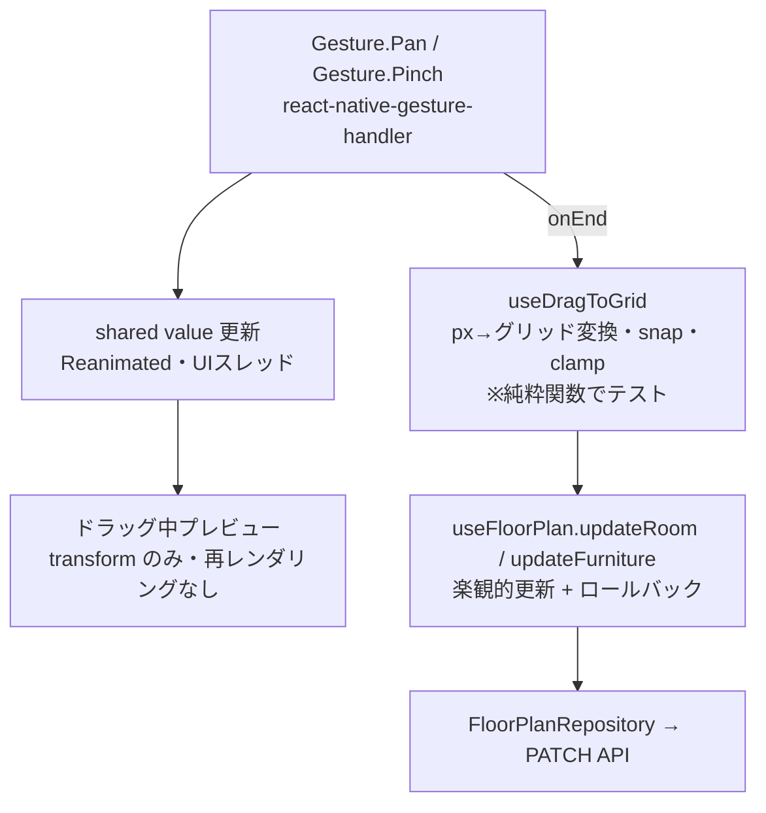

# Design Document — 間取りエディタ v2（操作性改善・UIリッチ化）

## Overview

v1 で構築した間取りエディタに、(1) ドラッグ移動・リサイズなどの直接操作、(2) 重なりの自動回避と警告、(3) デザイントークンに基づくリッチなUI、を追加する。

API 契約は `PATCH /rooms/{roomId}`（RoomUpdate: 名称・座標・サイズの部分更新）と `PATCH /furniture/{furnitureId}` が既に対応済みのため、**変更はモバイルのみ**。バックエンド・OpenAPI・DBマイグレーションは一切触らない。

## Steering Document Alignment

### Technical Standards (tech.md)

- **60fps（ADR-001）**: ドラッグ中の座標は Reanimated shared value（UIスレッド）で更新し、React の再レンダリングを伴わない。グリッド確定はリリース時のみ
- **サーバーファースト**: 確定した座標のみ TanStack Query の mutation（楽観的更新＋ロールバック）で保存
- **契約ファースト**: 生成済みクライアント（`mobile/src/shared/api/`）の `updateRoom` / `updateFurniture` を利用

### Project Structure (structure.md)

- ジェスチャー計算ロジック: `features/floor-plan/hooks/useDragToGrid.ts`（純ロジックは関数として export しテスト）
- デザイントークン: `shared/theme/`（全 feature から参照可能な共有層）
- 空き位置探索などの純粋関数: `shared/utils/grid.ts` に追加（既存の `snapToGrid` / `rectsOverlap` / `clampWithin` と同居）

## Code Reuse Analysis

### Existing Components to Leverage

- **`shared/utils/grid.ts`**: `snapToGrid`（スナップ）・`rectsOverlap`（重なり判定）・`clampWithin`（境界クランプ）をドラッグ・警告表示でそのまま使う
- **`UpdateFurnitureUseCase`**: 実装済み（clampWithin 内蔵）。hooks からの配線のみ追加
- **`buildAddRoomMutationOptions` のパターン**: updateRoom / updateFurniture の楽観的更新も同じ構造で実装する
- **`FloorPlanCanvas` / `RoomShape` / `FurnitureItem`**: 描画構造は維持し、ジェスチャーとテーマを載せる

### Integration Points

- **生成APIクライアント**: `updateRoom(roomId, RoomUpdate)` / `updateFurniture(furnitureId, FurnitureUpdate)` を `FloorPlanRepository` に追加
- **FloorPlanCapability / heatmap**: 読み取りインターフェースは不変。座標が動くだけで契約に影響なし

## Architecture

### ドラッグの2層構造（60fps とテスト容易性の両立）



- **ドラッグ中**: shared value を `transform: translate` に反映するだけ。グリッド計算・状態更新はしない
- **リリース時**: 累積オフセット(px)をグリッド差分に変換 → `snapToGrid` → `clampWithin`（部屋はキャンバス矩形、家具は所属部屋矩形）→ mutation
- **座標変換ロジック**（`pxOffsetToGridDelta` 等）は Reanimated 非依存の純粋関数として export し、Jest で境界値まで検証する

### ジェスチャーの競合解決

- キャンバス: `Gesture.Pinch`（ズーム）+ `Gesture.Pan`（パン）
- 部屋・家具: 個別の `Gesture.Pan`
- 部屋・家具のジェスチャーがアクティブな間はキャンバスのパンを `blocksExternalGesture` / `requireExternalGestureToFail` で抑止する
- 現状の `ScrollView` 入れ子（縦横）はパン・ズーム実装時に廃止する（ドラッグと必ず競合するため）

### 重なりポリシー

v1 要件を踏襲し「**重なりは許可、ただし警告**」とする。

- 追加時: `findFreePosition`（`grid.ts` に新設）が左上から行優先で空きセルを走査し、`rectsOverlap` で衝突しない最初の位置を返す。空きが無ければ `null` → (0,0) 配置＋警告
- 表示: 描画時に全部屋ペアを `rectsOverlap` で判定し、重なっている部屋に警告スタイル（エラーカラーの枠・アイコン）を付与する。判定は部屋数十件規模なので O(n²) で十分

### テーマ構造

```
shared/theme/
├── tokens.ts     # palette（生値）＋ semantic tokens（light/dark 2セット）
│                 #   colors / spacing / radius / typography / elevation
│                 #   roomType別アクセント（LIVING/KITCHEN/... × light/dark）
├── ThemeProvider.tsx  # useColorScheme を購読し semantic tokens を配布
└── useAppTheme.ts     # feature 側が使う唯一の入口
```

- feature コンポーネントは `useAppTheme()` 経由でのみ色・余白を取得し、リテラル色コードを持たない
- Skia 描画（グリッド線）にも同じトークンを渡す

## Components and Interfaces

### useDragToGrid (hooks・新規)
- **Purpose:** pan ジェスチャーの px オフセットをグリッド座標に確定させる共通フック
- **Interfaces:** `useDragToGrid({ rect, bounds, cellSize, onCommit(gridRect) })` → `{ gesture, animatedStyle }`
- **Reuses:** snapToGrid, clampWithin

### ResizeHandle (components・新規)
- **Purpose:** 選択中の部屋の右下に表示するリサイズ用ハンドル。pan で gridW/gridH を変更
- **Interfaces:** `props: { room, cellSize, onCommit(size) }`
- **Reuses:** useDragToGrid（軸をサイズに読み替え）

### BottomSheet (shared/components・新規)
- **Purpose:** AddRoom / AddFurniture を置き換える汎用ボトムシート（背景オーバーレイ＋スライドイン）
- **Interfaces:** `props: { visible, onClose, children }`
- **Reuses:** shared/theme

### FloatingActionButton (shared/components・新規)
- **Purpose:** 追加操作の起点。画面右下固定
- **Reuses:** shared/theme

### useFloorPlan (hooks・拡張)
- **Interfaces（追加分）:** `updateRoom.mutate({ roomId, input })` / `updateFurniture.mutate({ furnitureId, roomId, input })`
- 楽観的更新: キャッシュ上の該当 room / furniture の座標を差し替え、onError で previous に戻す（addRoom と同パターン）

## Data Models

エンティティ変更なし。追加するのはクライアント内の型のみ。

```typescript
// shared/utils/grid.ts
export function findFreePosition(
    size: { w: number; h: number },
    obstacles: Rect[],
    bounds: Rect,
): Point | null;

// shared/theme/tokens.ts
export type AppTheme = {
    colors: { background, surface, surfaceAlt, text, textMuted,
              primary, danger, outline, gridLine, ... };
    roomAccents: Record<RoomType, { fill: string; accent: string; icon: string }>;
    spacing: { xs, sm, md, lg, xl };
    radius: { sm, md, lg };
    typography: { title, body, caption, label };
    elevation: { card, sheet };
};
```

## Error Handling

### Error Scenarios

1. **移動・リサイズの保存失敗（ネットワーク断など）**
   - **Handling:** 楽観的更新をロールバックし、元の位置に戻す。Toast で失敗を通知
   - **User Impact:** 部屋が元の位置にアニメーションなしで戻り、「保存に失敗しました」表示

2. **空き位置が見つからない（キャンバス満杯）**
   - **Handling:** `findFreePosition` が `null` → (0,0) に配置し重なり警告を表示
   - **User Impact:** 部屋は追加されるが警告スタイルで表示され、手動移動を促される

3. **Reanimated / gesture-handler 未初期化（テスト環境）**
   - **Handling:** jest-expo のモック（`react-native-gesture-handler/jestSetup` 等）を jest 設定に追加し、コンポーネントテストが Skia フォールバックと同様に成立するようにする

## Testing Strategy

### Unit Testing

- `findFreePosition`: 空きあり／障害物回避／満杯で null ／境界ぴったり
- `pxOffsetToGridDelta` ほか座標変換純関数: 正・負オフセット、セル境界ちょうど、丸め
- `buildUpdateRoomMutationOptions` / `buildUpdateFurnitureMutationOptions`: 楽観的更新・ロールバック（既存の useFloorPlan テストと同型）
- tokens: light/dark で必須トークンが揃っていること

### Integration Testing

- `@testing-library/react-native` で「リリース時に onCommit がスナップ済み座標で呼ばれる」ことをフックレベルで検証（ジェスチャー自体は fireGestureHandler / モックで駆動）
- 画面テスト: 部屋追加→重ならない位置に配置される／重なり時に警告表示

### End-to-End Testing

- Maestro シナリオ（issue #68/#70 の戦略に従う）: 部屋追加→ドラッグ→再起動→位置が保持されている
