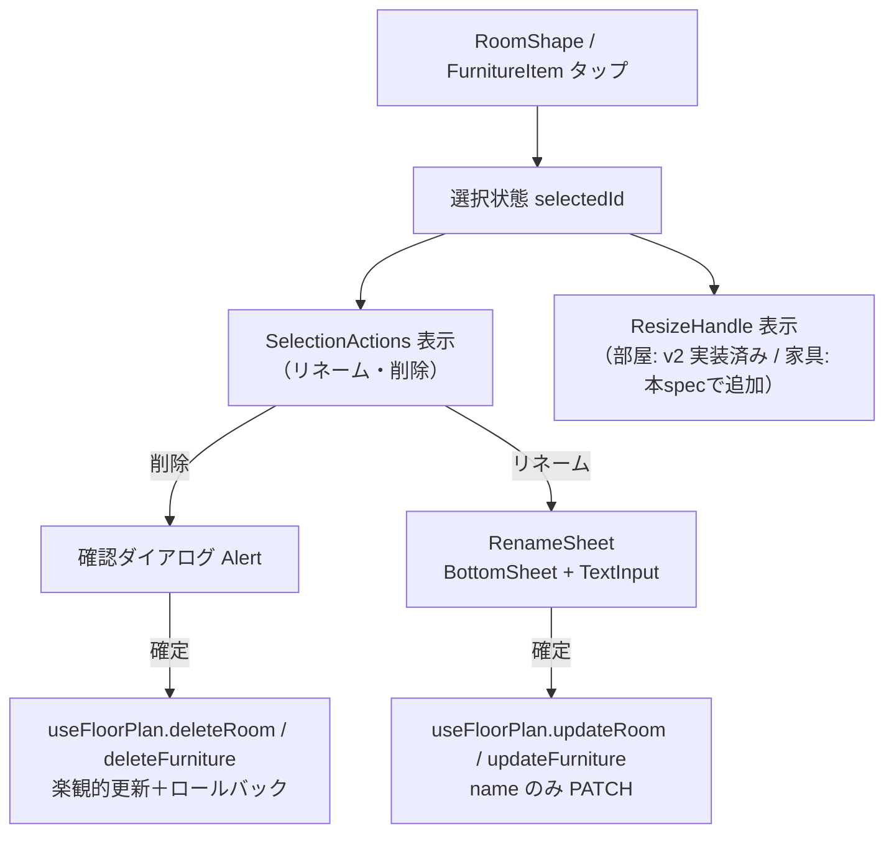

# Design Document — 間取りエディタ v3（編集の完結性: 削除・リサイズ・リネーム・サイズ指定）

## Overview

v2 までに構築した間取りエディタへ、(1) 部屋・家具の削除導線、(2) 家具のリサイズ、(3) 名称変更、(4) 追加時サイズ指定、(5) 家具の空き配置、を追加する。

API 契約は `DELETE /rooms/{roomId}` / `DELETE /furniture/{furnitureId}` / `PATCH ...`（name・座標・サイズの部分更新）がすべて対応済みのため、**変更はモバイルのみ**。バックエンド・OpenAPI・DBマイグレーションは一切触らない。

## Steering Document Alignment

### Technical Standards (tech.md)

- **サーバーファースト**: 削除・リネーム・リサイズはすべて TanStack Query の mutation（楽観的更新＋ロールバック）で保存
- **契約ファースト**: 生成済みクライアント（`mobile/src/shared/api/`）の `deleteRoom` / `deleteFurniture` / `updateRoom` / `updateFurniture` を利用（`FloorPlanRepository` に配線済み）
- **60fps（ADR-001）**: 家具リサイズは v2 と同じ2層構造（Reanimated プレビュー＋リリース時確定）

### Project Structure (structure.md)

- 選択対象への操作UI: `features/floor-plan/components/SelectionActions.tsx`（新規）
- 名称編集: `features/floor-plan/components/RenameSheet.tsx`（新規、`shared/components/BottomSheet` ベース）
- プリセット家具の既定サイズ: `features/floor-plan/constants.ts` に追記

## Code Reuse Analysis

### Existing Components to Leverage

- **`DeleteRoomUseCase` / `DeleteFurnitureUseCase`**: 実装済み。hooks からの配線のみ追加
- **`useFloorPlan.deleteRoom`**: mutation 実装済み。画面導線のみ追加（`deleteFurniture` mutation は新設）
- **`ResizeHandle` / `useDragToGrid`**: 部屋リサイズ（v2 タスク13）の実装を bounds を所属部屋矩形に差し替えて家具に適用
- **`findFreePosition`（shared/utils/grid.ts）**: 部屋内相対座標系（bounds = 0,0〜部屋のgridW/gridH）でそのまま再利用
- **`BottomSheet` / `FloatingActionButton`（shared/components）**: RenameSheet・SelectionActions の部品
- **`buildAddRoomMutationOptions` のパターン**: deleteFurniture / rename の楽観的更新も同じ構造で実装

### Integration Points

- **FloorPlanCapability / heatmap**: 読み取りインターフェースは不変。部屋・家具の削除はサーバー側カスケード（パーツ・掃除記録）に従い、クエリ invalidate で反映される
- **cleaning-record**: 削除カスケードの表示（確認ダイアログの文言）以外に依存なし

## Architecture

### 選択 → 操作の一元化

v2 で「選択状態のハイライト・ハンドル表示」（v2 Req 7.4）が整ったため、破壊的・属性的な操作はすべて**選択中の対象に対するアクションバー**に集約する。



- 確認ダイアログは React Native 標準の `Alert.alert`（破壊的スタイル）を使い、独自モーダルは作らない
- 削除の楽観的更新: キャッシュから該当 room / furniture を除去し、onError で previous に戻す

### 家具リサイズ

- `ResizeHandle` を `FurnitureItem` の選択時に表示。bounds は所属部屋の矩形（相対座標系で 0,0〜gridW,gridH）、最小 1×1
- 確定時に `updateFurniture.mutate`（`UpdateFurnitureUseCase` が clampWithin 内蔵）

### 追加時サイズ指定と空き配置

- `AddRoomModal`: 幅・高さのステッパー（1〜キャンバス上限、既定 4×4）を追加。onSubmit の引数に gridW/gridH を追加（既存呼び出しは既定値で互換維持）
- `AddFurnitureModal`: プリセット定義（`constants.ts`）に `defaultSize: { w, h }` を追加し、選択時に初期値へ反映。自由名称入力時は 1×1
- 画面側（`[roomId].tsx` の handleAddFurniture）:
  1. 指定サイズを部屋サイズにクランプ
  2. `findFreePosition(size, 既存家具矩形, {x:0, y:0, w:room.gridW, h:room.gridH})` で空き探索
  3. null なら (0,0)
  - **既存バグの修正を含む**: 現状は `room.gridX / room.gridY`（キャンバス絶対座標）を部屋内相対座標として渡しており、部屋が原点以外にあると家具が部屋外相当の座標で保存される。本タスクで相対座標系に正す

## Components and Interfaces

### SelectionActions (components・新規)
- **Purpose:** 選択中の部屋・家具に対する操作バー（リネーム・削除）。キャンバス下部に表示
- **Interfaces:** `props: { targetName: string; onRename(): void; onDelete(): void }`
- **Reuses:** shared/theme（danger トークン）

### RenameSheet (components・新規)
- **Purpose:** 名称編集用ボトムシート。現名称を初期値に、空白のみは確定不可
- **Interfaces:** `props: { visible: boolean; initialName: string; onSubmit(name: string): void; onClose(): void }`
- **Reuses:** shared/components/BottomSheet, shared/theme

### FurnitureItem (components・拡張)
- 選択時に `ResizeHandle` を表示し、確定サイズを `onResizeEnd(furnitureId, rect)` で親へ
- **Reuses:** ResizeHandle, useDragToGrid

### AddRoomModal / AddFurnitureModal (components・拡張)
- サイズステッパー／プリセット既定サイズを追加。`onSubmit` のペイロードに `gridW` / `gridH` を追加

### useFloorPlan (hooks・拡張)
- **追加分:** `deleteFurniture.mutate({ furnitureId })`（楽観的更新: キャッシュから該当家具を除去）
- `updateRoom` / `updateFurniture` は name のみの部分更新にも対応していることをテストで保証（実装は RoomUpdate/FurnitureUpdate が partial のため変更不要の見込み）

## Data Models

エンティティ変更なし。クライアント内の型のみ追加。

```typescript
// features/floor-plan/constants.ts（追記）
export type FurniturePreset = {
    key: string;
    label: string;
    defaultSize: { w: number; h: number }; // 追加
};

// AddRoomModal onSubmit ペイロード（拡張）
type AddRoomInput = { name: string; type: RoomType; gridW: number; gridH: number };

// AddFurnitureModal onSubmit ペイロード（拡張）
type AddFurnitureInput = { name: string; presetKey?: string; gridW: number; gridH: number };
```

## Error Handling

### Error Scenarios

1. **削除の保存失敗（ネットワーク断など）**
   - **Handling:** 楽観的更新をロールバックし、部屋・家具を復元。Toast で失敗を通知
   - **User Impact:** 消えたはずの対象が戻り、「削除に失敗しました」表示

2. **リネームの保存失敗**
   - **Handling:** キャッシュの name をロールバック。RenameSheet は閉じたまま失敗を通知
   - **User Impact:** 名称が元に戻り、再試行できる

3. **家具リサイズで部屋からはみ出す**
   - **Handling:** `UpdateFurnitureUseCase` の clampWithin で部屋境界に補正してから保存
   - **User Impact:** ハンドルを離すと部屋内に収まるサイズへスナップ

4. **家具追加時に部屋が満杯**
   - **Handling:** `findFreePosition` が null → 相対 (0,0) に配置（重なり許容）
   - **User Impact:** 家具は追加されるが重なって表示され、手動移動を促される

## Testing Strategy

### Unit Testing

- `useFloorPlan.deleteFurniture`: 楽観的除去／失敗時ロールバック（deleteRoom と同型）
- `useFloorPlan.updateRoom / updateFurniture`（name のみ）: 該当対象の name だけ差し替わる
- `RenameSheet`: 空・空白のみで確定不可／初期値表示／確定で onSubmit
- 家具の空き配置計算: 相対座標系の bounds で `findFreePosition` が正しく呼ばれる（satisfies 既存テスト）
- プリセット既定サイズ: 全プリセットに defaultSize が定義されている

### Integration Testing

- 部屋選択 → SelectionActions 表示 → 削除 → 確認 → キャンバスから消える
- 家具選択 → ResizeHandle ドラッグ確定 → クランプ済みサイズで updateFurniture が呼ばれる
- サイズ指定して部屋追加 → 指定サイズで addRoom が呼ばれる

### End-to-End Testing

- Maestro シナリオ（issue #68/#70 の戦略に従う）: 部屋追加（サイズ指定）→ 家具追加（重ならない）→ 家具リサイズ → 部屋リネーム → 部屋削除 → 再起動して反映が保持
