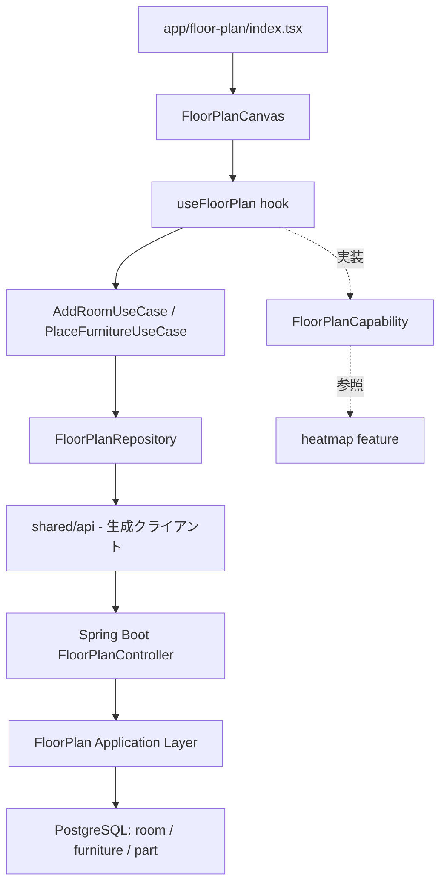

# Design Document — 間取りエディタ

## Overview

間取りエディタは、グリッドベースのキャンバス上に矩形の部屋を配置し、その内部に家具・家電を置く機能。作成した間取りはサーバー（PostgreSQL）に永続化され、ヒートマップ・掃除記録機能の土台となる。

間取りはすべて**グリッド座標（相対整数値）**で表現し、実寸・住所・GPSは扱わない。描画は React Native Skia、サーバー状態管理は TanStack Query、バックエンドは Spring Boot + Kotlin の REST API（OpenAPI契約ファースト）で構成する。

## Steering Document Alignment

### Technical Standards (tech.md)

- **サーバーファースト**: 間取りデータはすべてサーバーに保存。モバイルは TanStack Query でフェッチ・キャッシュ・楽観的更新を行う
- **UUID主キー**: room / furniture / part の全エンティティが UUID v4 を主キーに持つ
- **OpenAPI契約ファースト**: `api/openapi.yaml` にエンドポイントとスキーマを定義し、TypeScriptクライアント・Spring Bootスタブを生成する
- **React Native Skia**: ADR-001 の通り、キャンバス描画に Skia を用いる
- **60fps**: グリッドスナップ計算は純粋関数として shared/utils に置き、ドラッグ中の毎フレーム呼び出しに耐える

### Project Structure (structure.md)

- `features/floor-plan/` 配下に components / hooks / usecases / repositories / types.ts を配置
- 他featureからの参照は `capabilities/FloorPlanCapability.ts` 経由（heatmap が間取り情報を読むため）
- バックエンドは `backend/.../floorplan/` に presentation / application / domain / infrastructure を配置

## Code Reuse Analysis

新規featureのため既存コードは少ないが、以下を前提に構築する。

### Existing Components to Leverage

- **shared/components**: Button・Card 等の汎用UIパーツを部屋種別選択・家具追加モーダルで利用
- **shared/api**: OpenAPI Generator が生成する FloorPlan APIクライアント
- **shared/utils**: グリッドスナップ・矩形衝突判定の純粋関数を新規追加（他featureからも再利用可能）

### Integration Points

- **FloorPlanCapability**: heatmap featureが「部屋・家具の一覧と座標」を取得するための境界インターフェース
- **PostgreSQL**: room / furniture / part テーブルを新規作成（Flyway V1マイグレーション）
- **掃除記録 (cleaning-record)**: part エンティティを共有。間取りエディタが part を生成し、cleaning-record がその掃除状態を更新する

## Architecture

部屋・家具・パーツを**リレーショナルなテーブル**として持つ。ヒートマップ・掃除記録機能がパーツ単位の最終掃除日時・推奨周期を頻繁にクエリするため、パーツを行として保持する。

### Modular Design Principles

- **描画とロジックの分離**: FloorPlanCanvas は座標を受け取って描くだけ。スナップ計算・衝突判定は usecases / utils に隔離
- **レイヤー一方向依存**: components → hooks → usecases → repositories → shared/api
- **1ユースケース1クラス**: AddRoom / ResizeRoom / PlaceFurniture などを個別ユースケースに分割



## Components and Interfaces

### FloorPlanCanvas (components)
- **Purpose:** グリッド・部屋矩形・家具を Skia で描画し、タッチイベントを hooks に渡す
- **Interfaces:** `props: { rooms, furniture, onRoomDrag, onFurnitureDrag, selectedId }`
- **Dependencies:** React Native Skia, useFloorPlan
- **Reuses:** —（描画専任、ロジックなし）

### useFloorPlan (hooks)
- **Purpose:** 間取りの状態管理。TanStack Query で取得し、ドラッグ中のローカル状態と楽観的更新を仲介
- **Interfaces:** `{ rooms, furniture, addRoom, moveRoom, resizeRoom, addFurniture, moveFurniture, remove }`
- **Dependencies:** usecases, useQuery/useMutation
- **Reuses:** TanStack Query

### Grid utilities (shared/utils)
- **Purpose:** グリッドスナップ・矩形衝突判定の純粋関数
- **Interfaces:** `snapToGrid(point, cellSize): GridCoord` / `rectsOverlap(a, b): boolean` / `clampWithin(child, parent): Rect`
- **Dependencies:** なし（純粋関数）
- **Reuses:** 他featureからも利用可能

### AddRoomUseCase / ResizeRoomUseCase / PlaceFurnitureUseCase (usecases)
- **Purpose:** 部屋追加・リサイズ・家具配置のビジネスロジック。種別→プリセットパーツのseedもここで行う
- **Interfaces:** `execute(input): Result`
- **Dependencies:** FloorPlanRepository
- **Reuses:** Grid utilities

### FloorPlanRepository (repositories)
- **Purpose:** 間取りCRUDのAPI呼び出し実装
- **Interfaces:** `getFloorPlan()` / `saveRoom(room)` / `saveFurniture(furniture)` / `deleteRoom(id)` ...
- **Dependencies:** shared/api（生成クライアント）
- **Reuses:** OpenAPI生成クライアント

### FloorPlanController → AddRoomUseCase → FloorPlanRepositoryImpl (MyBatis) (backend)
- **Purpose:** presentation/application/infrastructure の3層でCRUDを実装。infrastructureはMyBatis Mapperでデータアクセスを行う
- **Interfaces:** REST: `/floor-plan`, `/rooms`, `/rooms/{roomId}/furniture`
- **Dependencies:** domain（FloorPlan/Room/Furniture/Part）
- **Reuses:** shared/web の共通レスポンス型・例外ハンドラ

## Data Models

座標はすべてグリッド単位の整数。`gridX, gridY` は左上原点のセル位置、`gridW, gridH` はセル数。

### Room
```
- id: UUID (PK)
- userId: UUID            # 初回発行UUID。所有者識別
- name: String            # 例: リビング
- type: RoomType (enum)   # KITCHEN / BATHROOM / BEDROOM / LIVING / TOILET / OTHER
- gridX: Int              # 左上セルX
- gridY: Int              # 左上セルY
- gridW: Int              # 幅（セル数）
- gridH: Int              # 高さ（セル数）
- createdAt / updatedAt: Timestamp
```

### Furniture
```
- id: UUID (PK)
- roomId: UUID (FK → Room)   # 所属部屋
- name: String               # プリセット名 or 自由名称
- presetKey: String?         # プリセット由来なら識別キー、自由名称ならnull
- gridX: Int                 # 部屋内の相対セルX
- gridY: Int
- gridW: Int
- gridH: Int
- createdAt / updatedAt: Timestamp
```

### Part（掃除単位 — cleaning-record と共有）
```
- id: UUID (PK)
- ownerType: enum (ROOM | FURNITURE)   # パーツの所属対象
- ownerId: UUID                         # Room.id または Furniture.id
- name: String                          # 例: 床、鏡、フィルター
- recommendedCycleDays: Int             # 推奨周期（日）
- lastCleanedAt: Timestamp?             # 最終掃除日時（未掃除はnull）
- createdAt / updatedAt: Timestamp
```

- 部屋に種別を設定すると、種別に対応するプリセットパーツ群が Part として seed される
- Part は間取りエディタが生成し、cleaning-record / heatmap が参照・更新する

### RoomType → プリセットパーツの対応（seed）
```
KITCHEN  → シンク, コンロ, 換気扇, 床
BATHROOM → 浴槽, 床, 鏡, 排水口
TOILET   → 便器, 床, 壁
BEDROOM  → 床, 寝具まわり
LIVING   → 床, 窓, エアコンフィルター
OTHER    → 床
```

## API（OpenAPI 抜粋）

| メソッド | パス | 用途 |
|---|---|---|
| GET | `/floor-plan` | UUIDに紐付く間取り全体（部屋＋家具）を取得 |
| POST | `/rooms` | 部屋を追加（種別指定でプリセットパーツseed） |
| PATCH | `/rooms/{roomId}` | 部屋の座標・サイズ・名称を更新 |
| DELETE | `/rooms/{roomId}` | 部屋を削除（配下の家具・パーツも連鎖削除） |
| POST | `/rooms/{roomId}/furniture` | 部屋内に家具を追加 |
| PATCH | `/furniture/{furnitureId}` | 家具の座標・サイズ・名称を更新 |
| DELETE | `/furniture/{furnitureId}` | 家具を削除（配下のパーツも連鎖削除） |

- UUIDはHTTPヘッダ（MVP）またはJWT（V2以降）でサーバーに渡す
- ネストは最大2階層（structure.md準拠）

## Error Handling

### Error Scenarios

1. **サーバー保存失敗（ネットワーク断）**
   - **Handling:** TanStack Query の onError でロールバック。編集内容はローカル状態に残し、再試行ボタンを表示
   - **User Impact:** 「保存に失敗しました。再試行」トースト。編集内容は消えない

2. **家具を部屋の外に配置しようとする**
   - **Handling:** clampWithin で部屋境界内に座標を制約。サーバー送信前にクライアントで補正
   - **User Impact:** 家具が部屋の縁で止まる

3. **存在しない部屋への家具追加（並行削除等）**
   - **Handling:** サーバーが404を返し、クライアントは間取りを再フェッチして整合を取る
   - **User Impact:** 間取りが最新状態に再描画される

4. **UUID未発行状態でのAPI呼び出し**
   - **Handling:** アプリ起動時にUUIDを生成・保存してから間取り画面に遷移する前提。未発行なら生成処理を先行
   - **User Impact:** 透過的（ユーザーは意識しない）

## Testing Strategy

### Unit Testing
- **Grid utilities**: snapToGrid / rectsOverlap / clampWithin の境界値テスト（純粋関数なので最重要）
- **UseCases**: 種別→プリセットパーツseedのマッピング、リサイズ時の検証ロジック
- **backend application層**: AddRoomUseCase のseed生成、連鎖削除

### Integration Testing
- **API**: RestAssured で各エンドポイントのCRUD・連鎖削除・UUIDスコープ分離を検証
- **永続化**: room/furniture/part の外部キー連鎖削除がDBレベルで動くこと

### End-to-End Testing
- 新規ユーザーが空状態から部屋を追加 → 種別選択 → 家具配置 → 再起動して復元、までの一連フロー
